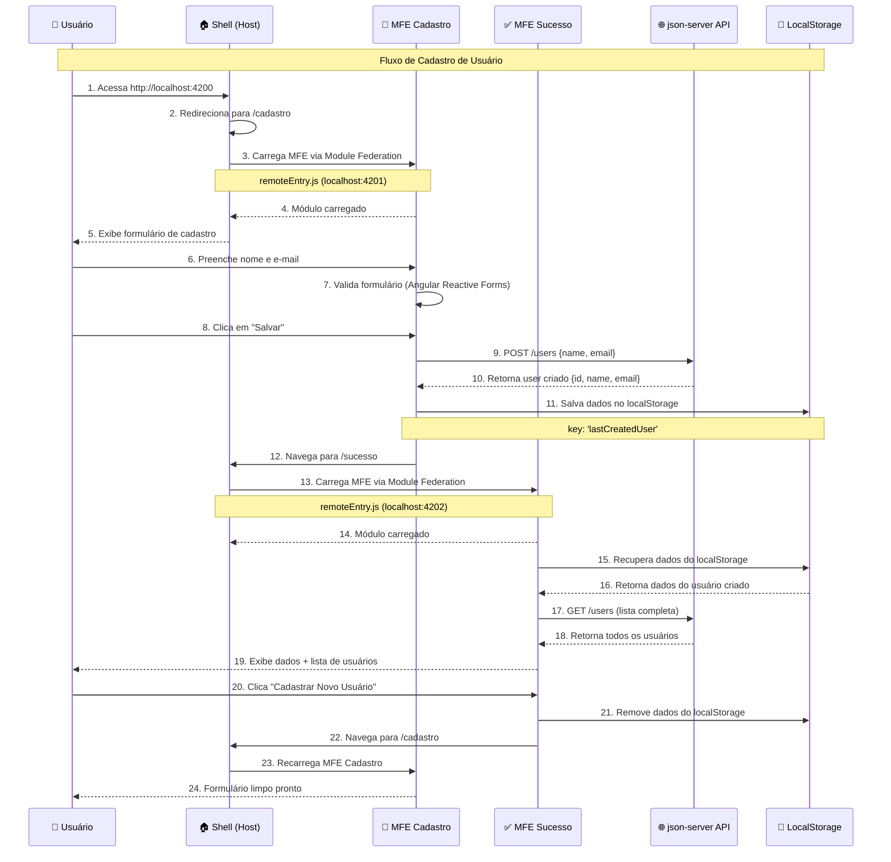
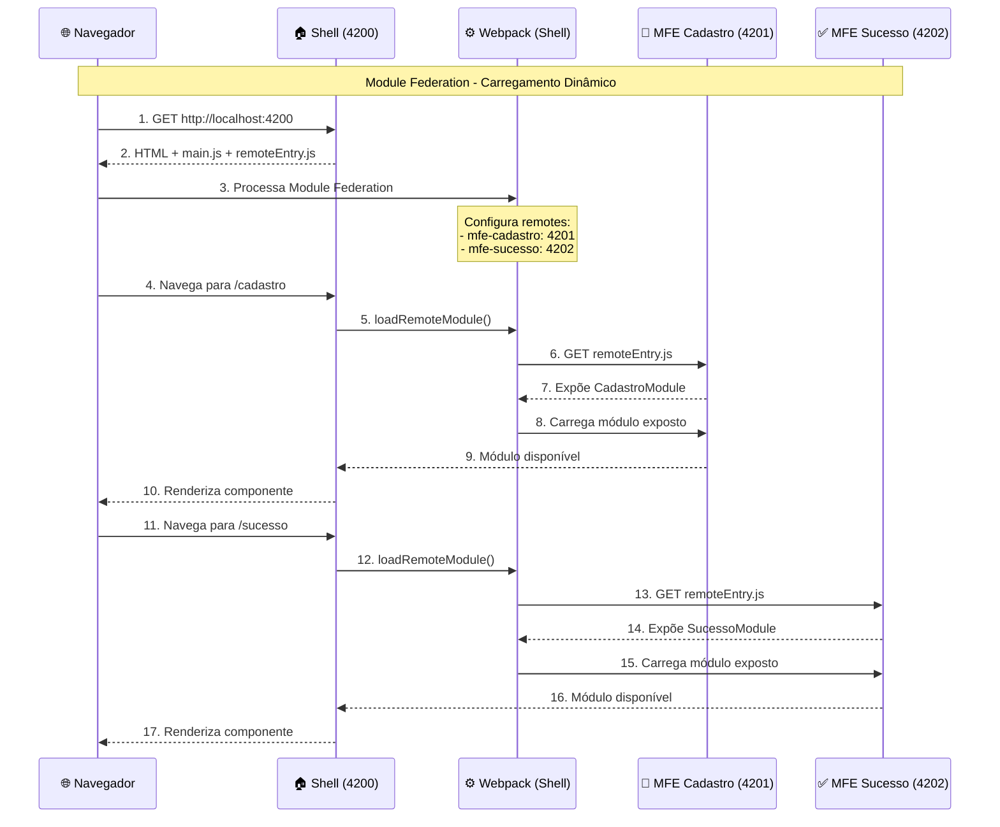
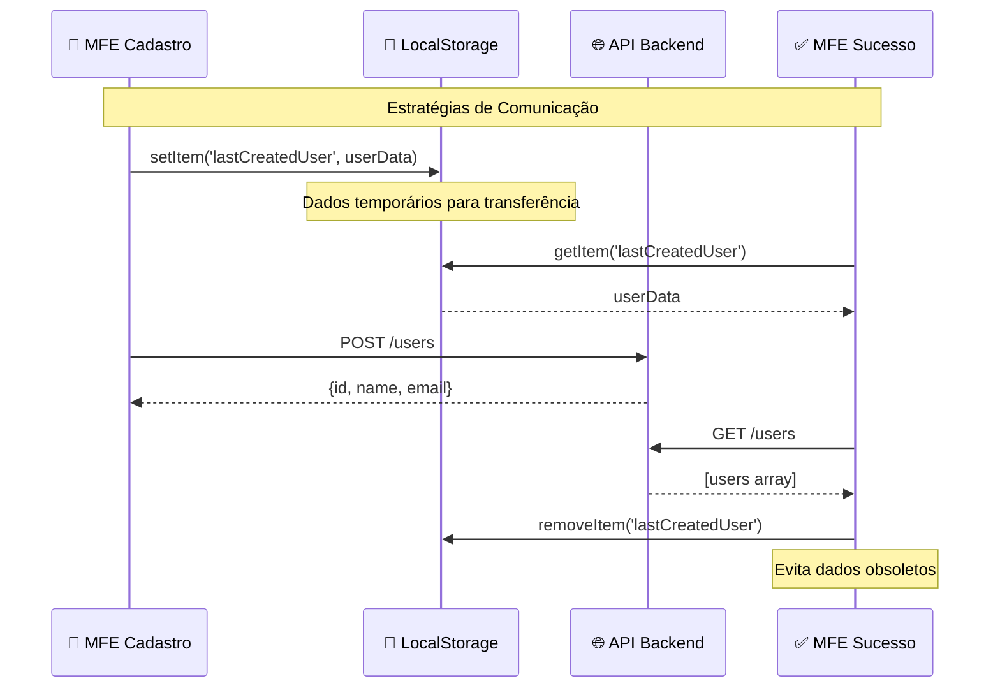

# Diagrama de Sequência - Microfrontends App

## Fluxo Principal de Cadastro e Sucesso

```mermaid
sequenceDiagram
    participant User as 👤 Usuário
    participant Shell as 🏠 Shell (Host)
    participant MFE_Cad as 📝 MFE Cadastro
    participant MFE_Suc as ✅ MFE Sucesso
    participant API as 🌐 json-server API
    participant LS as 💾 LocalStorage

    Note over User, LS: Fluxo de Cadastro de Usuário

    %% Acesso inicial
    User->>Shell: 1. Acessa http://localhost:4200
    Shell->>Shell: 2. Redireciona para /cadastro
    
    %% Carregamento do MFE Cadastro
    Shell->>MFE_Cad: 3. Carrega MFE via Module Federation
    Note over Shell, MFE_Cad: remoteEntry.js (localhost:4201)
    MFE_Cad-->>Shell: 4. Módulo carregado
    Shell-->>User: 5. Exibe formulário de cadastro

    %% Preenchimento do formulário
    User->>MFE_Cad: 6. Preenche nome e e-mail
    MFE_Cad->>MFE_Cad: 7. Valida formulário (Angular Reactive Forms)
    
    %% Submissão dos dados
    User->>MFE_Cad: 8. Clica em "Salvar"
    MFE_Cad->>API: 9. POST /users {name, email}
    API-->>MFE_Cad: 10. Retorna user criado {id, name, email}
    
    %% Persistência e navegação
    MFE_Cad->>LS: 11. Salva dados no localStorage
    Note over MFE_Cad, LS: key: 'lastCreatedUser'
    MFE_Cad->>Shell: 12. Navega para /sucesso
    
    %% Carregamento do MFE Sucesso
    Shell->>MFE_Suc: 13. Carrega MFE via Module Federation
    Note over Shell, MFE_Suc: remoteEntry.js (localhost:4202)
    MFE_Suc-->>Shell: 14. Módulo carregado
    
    %% Exibição dos dados
    MFE_Suc->>LS: 15. Recupera dados do localStorage
    LS-->>MFE_Suc: 16. Retorna dados do usuário criado
    MFE_Suc->>API: 17. GET /users (lista completa)
    API-->>MFE_Suc: 18. Retorna todos os usuários
    MFE_Suc-->>User: 19. Exibe dados + lista de usuários

    %% Volta ao cadastro
    User->>MFE_Suc: 20. Clica "Cadastrar Novo Usuário"
    MFE_Suc->>LS: 21. Remove dados do localStorage
    MFE_Suc->>Shell: 22. Navega para /cadastro
    Shell->>MFE_Cad: 23. Recarrega MFE Cadastro
    MFE_Cad-->>User: 24. Formulário limpo pronto
```

## Fluxo de Carregamento dos MFEs

```mermaid
sequenceDiagram
    participant Browser as 🌐 Navegador
    participant Shell as 🏠 Shell (4200)
    participant WP_Shell as ⚙️ Webpack (Shell)
    participant MFE1 as 📝 MFE Cadastro (4201)
    participant MFE2 as ✅ MFE Sucesso (4202)

    Note over Browser, MFE2: Module Federation - Carregamento Dinâmico

    Browser->>Shell: 1. GET http://localhost:4200
    Shell-->>Browser: 2. HTML + main.js + remoteEntry.js
    
    Browser->>WP_Shell: 3. Processa Module Federation
    Note over WP_Shell: Configura remotes:<br/>- mfe-cadastro: 4201<br/>- mfe-sucesso: 4202
    
    %% Lazy loading baseado na rota
    Browser->>Shell: 4. Navega para /cadastro
    Shell->>WP_Shell: 5. loadRemoteModule()
    WP_Shell->>MFE1: 6. GET remoteEntry.js
    MFE1-->>WP_Shell: 7. Expõe CadastroModule
    WP_Shell->>MFE1: 8. Carrega módulo exposto
    MFE1-->>Shell: 9. Módulo disponível
    Shell-->>Browser: 10. Renderiza componente

    Browser->>Shell: 11. Navega para /sucesso  
    Shell->>WP_Shell: 12. loadRemoteModule()
    WP_Shell->>MFE2: 13. GET remoteEntry.js
    MFE2-->>WP_Shell: 14. Expõe SucessoModule
    WP_Shell->>MFE2: 15. Carrega módulo exposto
    MFE2-->>Shell: 16. Módulo disponível
    Shell-->>Browser: 17. Renderiza componente
```

## Fluxo de Comunicação entre MFEs

```mermaid
sequenceDiagram
    participant MFE_Cad as 📝 MFE Cadastro
    participant LS as 💾 LocalStorage
    participant API as 🌐 API Backend
    participant MFE_Suc as ✅ MFE Sucesso

    Note over MFE_Cad, MFE_Suc: Estratégias de Comunicação

    %% Estratégia 1: Via LocalStorage
    MFE_Cad->>LS: setItem('lastCreatedUser', userData)
    Note over LS: Dados temporários para transferência
    MFE_Suc->>LS: getItem('lastCreatedUser')
    LS-->>MFE_Suc: userData

    %% Estratégia 2: Via API (Single Source of Truth)
    MFE_Cad->>API: POST /users
    API-->>MFE_Cad: {id, name, email}
    MFE_Suc->>API: GET /users
    API-->>MFE_Suc: [users array]

    %% Limpeza após navegação
    MFE_Suc->>LS: removeItem('lastCreatedUser')
    Note over MFE_Suc: Evita dados obsoletos
```
